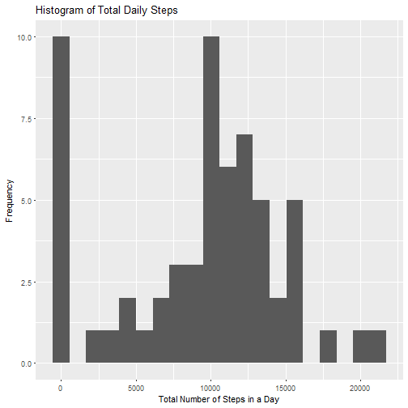
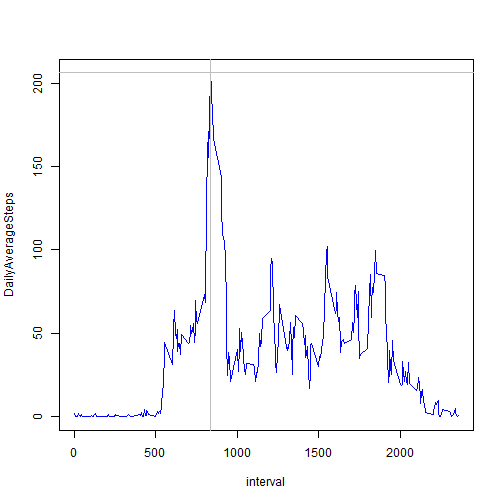
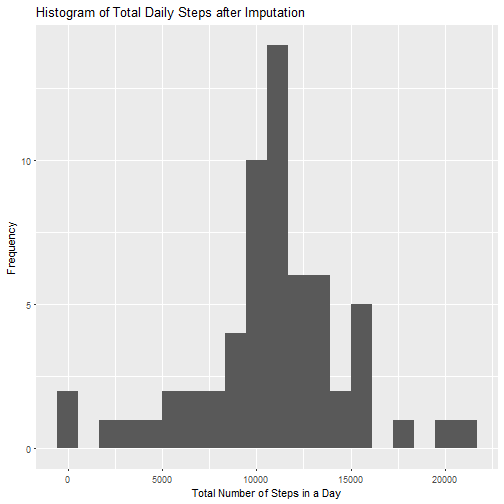
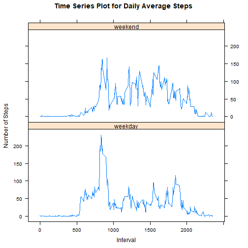

Reproducible Research: Peer Assessment 1
=========================================
Shashi Ranjan


## 1. Loading and preprocessing the data

We start by reading the data into our `activity` dataframe. We have already downloaded, unzipped and saved the data into the current working directory.
We will also look at the first few rows and the structure of the data to understand it better. The output of the below code is not shown here.


```r
activity <- read.csv("activity.csv")
head( activity)
str( activity)
```

We observe that the data has records for 61 days. We will create a new column `Day` as a `Date` object. This column will be used later in the subsequent portions of the assignment.

Separately, we also noticed that the steps variable has the appropriate `int` type. 


```r
library( lubridate)
activity$Day <- ymd(activity$date)
```


## 2. What is mean total number of steps taken per day?

### Histogram Plot of Daily Total Steps
We first calculate the number of steps taken for each day, and explore this visually using a histogram. The histogram is created using `bins = 20`.


```r
library( dplyr)
library( ggplot2)
daily_steps <- summarise( group_by (activity, Day), TotalSteps = sum(steps, na.rm = T))
ggplot( daily_steps, aes( TotalSteps)) + geom_histogram( bins = 20) +
      labs( x = "Total Number of Steps in a Day", y = "Frequency", title = "Histogram of Total Daily Steps")
```




### Mean and Median of Total Number of Steps Taken per Day
Given that we have the daily steps data, these metrics can simply be computed with a call to `summary` function.


```r
result <- summary(daily_steps$TotalSteps)
```

Thus, the mean of the daily steps is 9354.2295082 while the median is 1.0395 &times; 10<sup>4</sup>.


## 3. What is the average daily activity pattern?

### Time-Series Plot
We first need to calculate the average number of steps across all days for each 5-minute interval. We then plot a time-series chart for this data. A vertical and a horizontal lines are added for point with the highest average steps. This can be done through the below code chunk. 


```r
grp <- group_by( activity, interval)
interval_data <- summarise( grp, DailyAverageSteps = mean(steps, na.rm = TRUE))

highest_interval <- interval_data[ which.max( interval_data$DailyAverageSteps), ]$interval
highest_steps <- max( interval_data$DailyAverageSteps)

with( interval_data, plot( interval, DailyAverageSteps, type = "l", col = "blue"))
abline( h = highest_steps, v= highest_interval, col = "grey")
```



```r
paste( "Interval with highest average steps: ", highest_interval)
```

```
## [1] "Interval with highest average steps:  835"
```

```r
paste( "Highest number of steps in any interval: ", highest_steps)
```

```
## [1] "Highest number of steps in any interval:  206.169811320755"
```

### Interval with maximum number of steps
We notice that the maximum number of average daily steps (206.1698113) correspond to the interval 835.


## 4. Imputing missing values

### Total Number of Rows with `NA`s
Let's calculate and report the total number of missing values.


```r
sum( is.na( activity$steps))
```

```
## [1] 2304
```

### Fill in the Missing Values
We will use the daily average steps of the corresponding 5-minute interval for the missing values. A new dataset `activity_new` is created after imputing missing values in `activity` using this imputation strategy.


```r
activity_new <- activity
pos <- which(is.na( activity_new$steps))
for( i in pos){
      activity_new[ i, ]$steps <- interval_data[ which( interval_data$interval == activity_new[ i,]$interval), ]$DailyAverageSteps
}
```

### Impact of Imputing the Missing Data
Let's redo the histogram for the new dataset `activity_new` created after imputation.


```r
daily_steps_new <- summarise( group_by (activity_new, Day), TotalSteps = sum(steps))
ggplot( daily_steps_new, aes( TotalSteps)) + geom_histogram( bins = 20) +
      labs( x = "Total Number of Steps in a Day", y = "Frequency", title = "Histogram of Total Daily Steps after Imputation")
```




Hmmm. The new histogram does look very slightly different from the original one. Let's see if the imputation had any effect on the mean and median of the total daily steps. 


```r
# Summary of Total Steps after Imputation
summary( daily_steps_new$TotalSteps)
```

```
##    Min. 1st Qu.  Median    Mean 3rd Qu.    Max. 
##      41    9819   10766   10766   12811   21194
```

```r
# Summary of Total Steps in Original Data
summary( daily_steps$TotalSteps)
```

```
##    Min. 1st Qu.  Median    Mean 3rd Qu.    Max. 
##       0    6778   10395    9354   12811   21194
```

**We thus notice that both the mean and median metrics increased after imputation. **

## 5. Are there differences in activity patterns between weekdays and weekends?

### Adding a new vaiable for weekdays and weekends
We use the `weekdays()` function to identify the day for each row, and assign a new factor variable called `which_day` with two levels *weekday* and *weekend*. As it is not specifically mentioned as to whether the imputed or the original dataset is to be used for this exercise, we will be doing this on the updated and imputed dataset `activity_new`.


```r
activity_new$which_day <- as.factor(ifelse( weekdays( activity_new$Day) %in% c("Saturday", "Sunday"), "weekend", "weekday"))
daily_avgs <- summarise( group_by( activity_new, which_day, interval), DailySteps = mean(steps))
```

We will now plot a Time Series plot for the daily average steps for different intervals.


```r
library(lattice)
with( daily_avgs, xyplot( DailySteps ~ interval | which_day, layout = c(1,2), 
                          type = "l", 
                          xlab = "Interval", 
                          ylab = "Number of Steps",
                          main = "Time Series Plot for Daily Average Steps"))
```



